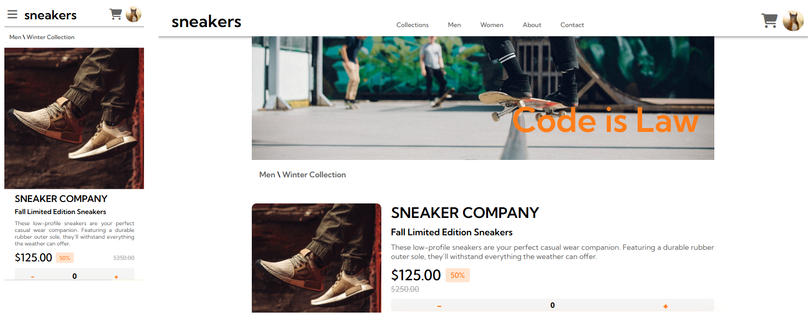

# Sneakers Shop

Mockup integration for Sneakers commercial page. 

## Educational Purpose

Translating a design into responsive HTML and CSS.

## Screenshots

## Resource files

Mockups, style guide and texts can be found in '00_readme' folder

## 🍞 About Me
Hi everyone, I'm Madame R. a Web Developer from France. 
Currently in training, I'm a database enthusiast.
Enjoy your stay, have a look at my other repositories and let's get in touch if you wish to work with me.

## 🛠️ Tech Stack

**Database:** MySQL Workbench, Doctrine

**Back End:** Symfony, WAMP (Windows, Apache, MySQL, PHP) or XAMPP (Cross-Platform, Apache, MySQL, PHP, and Perl)

**Front End:** HTML, CSS, Javascript, Bootstrap

**IDE:** Visual Studio Code

**Versioning:** Git, Github

## License

